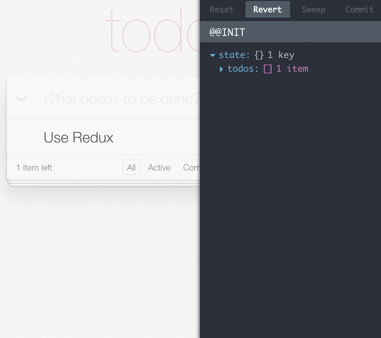
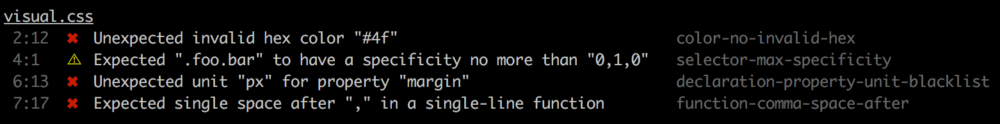

Guia Grab Front-End
==

_Créditos: [Illustration](https://dribbble.com/shots/3577639-Isometric-Developer-Desk) por [@yangheng](https://dribbble.com/yangheng)_

_Esse guia foi postado no [Free Code Camp](https://medium.freecodecamp.com/grabs-front-end-guide-for-large-teams-484d4033cc41)._

[Grab](https://www.grab.com) é a principal plataforma de transporte do sudeste da Ásia (SEA) e nossa missão é impulsionar o mar, aproveitando a mais recente tecnologia e as pessoas talentosas que temos na empresa.Em maio de 2017, lidamos com [2,3 milhões de passeios diariamente](https://www.bloomberg.com/news/videos/2017-05-11/tans-says-company-has-more-than-850-000-drivers-video) E estamos crescendo e contratando em uma escala rápida.

Para acompanhar o crescimento fenomenal de Grab, nossa equipe e plataformas da web também precisam crescer.Felizmente, ou infelizmente, na Grab, a equipe da web foi [Mantendo -se](https://blog.daftcode.pl/hype-driven-development-3469fc2e9b22) Com as melhores práticas mais recentes e incorporou o ecossistema javascript moderno em nossos aplicativos da web.

O resultado disso é que nossos novos contratados ou engenheiros de back-end, que não estão necessariamente bem-falados com o ecossistema javascript moderno, podem se sentir sobrecarregados com a enxurrada de coisas novas que eles precisam aprender apenas para concluir seu recurso ou correção de bug.um aplicativo da web.O desenvolvimento do front -end nunca foi tão complexo e emocionante como é hoje.Novas ferramentas, bibliotecas, estruturas e plug -ins emergem a cada dois dias e há muito a aprender.É imperativo que os recém -chegados à equipe da web sejam guiados a adotar essa evolução do front end, aprender a navegar no ecossistema com facilidade e se torne produtivo no código de remessa para nossos usuários o mais rápido possível.Criamos um guia de estudo para introduzir por que fazemos o que fazemos e como lidamos com o front -end em escala.

Este guia de estudo é inspirado por ["Um plano de estudo para curar fadiga de JavaScript"](https://medium.freecodecamp.com/a-study-plan-to-cure-javascript-fatigue-8ad3a54f2eb1#.g9egaapps) e é levemente opinativo no sentido de que recomendamos certas bibliotecas/estruturas para aprender para cada aspecto do desenvolvimento do front end, com base no que é atualmente considerado mais adequado no Grab.Explicamos por que uma determinada biblioteca/estrutura/ferramenta é escolhida e fornecemos links para recursos de aprendizagem para permitir que o leitor a busque por conta própria.Escolhas alternativas que podem ser melhores para outros casos de uso também são fornecidas para referência e auto-exploração adicional.

Se você estiver familiarizado com o desenvolvimento do front end e tem acompanhado constantemente os desenvolvimentos mais recentes, este guia provavelmente não será tão útil para você.É direcionado aos recém -chegados Equipe ao front 

Se sua empresa também estiver explorando uma pilha javascript moderna, você também pode achar este plano de estudo útil para sua empresa!Sinta -se à vontade para adaptá -lo às suas necessidades.Atualizaremos este plano de estudo periodicamente, de acordo com nosso trabalho e Equipe opções mais

*- Equipe Grab Web*

**Pre-requisítos**

boaCompreensãoDosPrincipaisConceitosDeProgramaçãoConfortávelComAçõesBásicasDaLinhaDeComandoEFamiliaridadeComSistemasDeControleDeVersãoDoCódigoFonte,ComoOGitExperiênciaEmDesenvolvimentoWebConstruíramAplicativosDaWebRenderizadosPeloServidorUsandoEstruturasComoRubyOnRails,Django,Express,EtcCompreensãoDeComoAWebFuncionaFamiliaridadeComProtocolosDaWebEConvençõesComoHttpEApIsResTful

### Índice

- [Aplicativos de página única (SPAs)](#single-page-apps-spas)
- [JavaScript de nova era](#new-age-javascript)
- [Interface de usuário](#user-interface---react)
- [Gerenciamento do Estadot](#state-management---fluxredux)
- [Codificação com estilo](#coding-with-style---css-modules)
- [Manutenção](#maintainability)
  - [Teste](#testing---jest--enzyme)
  - [JavaScript de linhat](#linting-javascript---eslint)
  - [CSS de linha](#linting-css---stylelint)
  - [Código de formatação](#formatting-code---prettier)
  - [Tipos](#types---flow)
- [Sistema de construção](#build-system---webpack)
- [Gerenciamento de pacotes](#package-management---yarn)
- [Integração contínua](#continuous-integration)
- [Hospedagem e CDN](#hosting-and-cdn)
- [Implantação](#deployment)
- [Monitoramento](#monitoring)

Certos tópicos podem ser ignorados se você tiver experiência anterior neles.

## Aplicativos de página única (SPAs)

Atualmente, os desenvolvedores da Web se referem aos produtos que eles criam como aplicativos da Web, em vez de sites.Embora não haja diferença estrita entre os dois termos, os aplicativos da Web tendem a ser altamente interativos e dinâmicos, permitindo que o usuário execute ações e receba uma resposta por sua ação.Tradicionalmente, o navegador recebe HTML do servidor e o renderiza.Quando o usuário navega para outra URL, é necessária uma atualização de página inteira e o servidor envia novos novos HTML para a nova página.Isso é chamado de renderização do lado do servidor.

No entanto, nos spas modernos, a renderização do lado do cliente é usada.O navegador carrega a página inicial do servidor, juntamente com os scripts (estruturas, bibliotecas, código do aplicativo) e folhas de estilo necessárias para o aplicativo inteiro.Quando o usuário navega para outras páginas, uma atualização de página não é acionada.O URL da página é atualizado através do [HTML5 API da história](https://developer.mozilla.org/en-US/docs/Web/API/History_API). Novos dados necessários para a nova página, geralmente no formato JSON, são recuperados pelo navegador via [AJAX](https://developer.mozilla.org/en-US/docs/AJAX/Getting_Started) solicitações ao servidor.O spa atualiza dinamicamente a página com os dados via JavaScript, que já baixou na página inicial do carregamento.Este modelo é semelhante ao funcionamento dos aplicativos móveis nativos.

Os benefícios:

- O aplicativo parece mais responsivo e os usuários não vêem o flash entre as navegações da página devido a atualizações de página inteira.
- Menos solicitações HTTP são feitas ao servidor, pois os mesmos ativos não precisam ser baixados novamente para cada carregamento de página.
- Clear separação das preocupações entre o cliente e o servidor;Você pode criar facilmente novos clientes para diferentes plataformas (por exemplo, móveis, chatbots, relógios inteligentes) sem precisar modificar o código do servidor.Você também pode modificar a pilha de tecnologia no cliente e no servidor de forma independente, desde que o contrato da API não esteja quebrado.

As desvantagens:

- Carga de página inicial mais pesada devido ao carregamento da estrutura, código do aplicativo e ativos necessários para várias páginas.<a href="#fn1" id="ref1">1</a>
- Há uma etapa adicional a ser feita no seu servidor, que é configurá-lo para rotear todas as solicitações para um único ponto de entrada e permitir que o roteamento do lado do cliente assuma o seu lugar.
- Os spas dependem do JavaScript para renderizar o conteúdo, mas nem todos os mecanismos de pesquisa executam JavaScript durante o rastreamento e podem ver conteúdo vazio na sua página.Isso prejudica inadvertidamente a otimização do mecanismo de pesquisa (SEO) do seu aplicativo. <a href="#fn2" id="ref2">2</a>. No entanto, na maioria das vezes, quando você está criando aplicativos, o SEO não é o fator mais importante, pois nem todo o conteúdo precisa ser indexível pelos mecanismos de pesquisa.Para superar isso, você pode renderizar seu aplicativo ou usar serviços como [Prerender](https://prerender.io/) Para "renderizar seu javascript em um navegador, salve o HTML estático e retorne isso aos rastreadores".

Embora os aplicativos renderizados do servidor tradicionais ainda sejam uma opção viável, uma clara escala de separação do cliente-servidor melhor para equipes de engenharia maiores, pois o código do cliente e do servidor pode ser desenvolvido e lançado de forma independente. Isso é especialmente verdadeiro quando temos vários aplicativos de clientes atingindo o mesmo servidor de API.

Como os desenvolvedores da Web agora estão construindo aplicativos em vez de páginas, a organização do JavaScript do lado do cliente se tornou cada vez mais importante. Nas páginas renderizadas do lado do servidor, é comum usar trechos de jQuery para adicionar interatividade do usuário a cada página. No entanto, ao criar grandes aplicativos, apenas o JQuery é insuficiente. Afinal, o JQuery é principalmente uma biblioteca para manipulação de Dom e não é uma estrutura; Ele não define uma estrutura e organização claras para o seu aplicativo.

As estruturas JavaScript foram criadas para fornecer abstrações de nível mais alto sobre o DOM, permitindo que você mantenha o estado na memória, fora do DOM. O uso de estruturas também traz os benefícios de reutilizar conceitos recomendados e práticas recomendadas para a criação de aplicativos. Um novo engenheiro da equipe que não está familiarizado com a base de código, mas tem experiência com uma estrutura, achará mais fácil entender o código porque está organizado em uma estrutura com a qual eles estão familiarizados. As estruturas populares têm muitos tutoriais e guias, e explorar o conhecimento e a experiência de colegas e a comunidade ajudará os novos engenheiros a se atualizar.

#### Links de estudo

- [App de página única: vantagens e desvantagens](http://stackoverflow.com/questions/21862054/single-page-app-advantages-and-disadvantages)
- [A (r) evolução do desenvolvimento da web](http://blog.isquaredsoftware.com/presentations/2016-10-revolution-of-web-dev/)
- [Eis por que a renderização do lado do cliente venceu](https://medium.freecodecamp.com/heres-why-client-side-rendering-won-46a349fadb52)

## JavaScript de nova era

Antes de mergulhar nos vários aspectos da criação de um aplicativo da Web JavaScript, é importante se familiarizar com o idioma da web - JavaScript ou Ecmascript.JavaScript é uma linguagem incrivelmente versátil que você também pode usar para construir [Servidores da Web](https://nodejs.org/en/), [Aplicativos móveis nativos](https://facebook.github.io/react-native/) e [Aplicativos de mesa](https://electron.atom.io/).

Antes de 2015, a última grande atualização foi o ECMAScript 5.1, em 2011. No entanto, nos últimos anos, o JavaScript viu de repente uma grande explosão de melhorias em um curto período de tempo.Em 2015, o ECMAScript 2015 (previamente chamado ECMAScript 6) foi lançado e uma tonelada de construções sintáticas foi introduzida para tornar o código de escrita menos pesado.Se você está curioso sobre isso, o Auth0 escreveu um bom artigo sobre o [História do JavaScript](https://auth0.com/blog/a-brief-history-of-javascript/). Até hoje, nem todos os navegadores implementaram totalmente a especificação ES2015.Ferramentas como [Babel](https://babeljs.io/) Permita que os desenvolvedores escrevam o ES2015 em seus aplicativos e Babel transpilizam -os para o ES5 para serem compatíveis para navegadores.

Estar familiarizado com o ES5 e o ES2015 é crucial.O ES2015 ainda é relativamente novo e muitos aplicativos de código de código aberto e node.js ainda estão escritos no ES5.Se você estiver em depuração no console do navegador, talvez não consiga usar a sintaxe ES2015.Por outro lado, a documentação e o código de exemplo para muitas bibliotecas modernas que apresentaremos mais tarde ainda estão escritas no ES2015.No Grab, nós usamos [babel-preset-env](https://github.com/babel/babel-preset-env) Para aproveitar o aumento da produtividade das melhorias sintáticas que o futuro do JavaScript oferece e estamos adorando até agora. `babel-preset-env` Determina de forma inteligente quais plug -ins Babel são necessários (quais novos recursos de idioma não são suportados e precisam ser transpilados) à medida que os navegadores aumentam o suporte nativo para mais recursos da linguagem ES.Se você preferir usar recursos de idioma que já estão estáveis, você pode achar que [babel-preset-stage-3](https://babeljs.io/docs/plugins/preset-stage-3/), que é uma especificação completa que provavelmente será implementada nos navegadores, será mais adequada.

Passe um ou dois dias revisando o ES5 e explorando o ES2015.Os recursos mais usados no ES2015 incluem "Arrows e Lexical This", "Classes", "Model Strings", "Destructuring", "Padrão/Rest/Spread Operadores" e "Módulos de Importação e Exportação".

**Duração estimada: 3-4 dias.** Você pode aprender/procurar a sintaxe ao aprender as outras bibliotecas e tentar criar seu próprio aplicativo.

#### Links de estudo

- [Aprenda ES5 no codecademy](https://www.codecademy.com/learn/learn-javascript)
- [Aprenda ES6 na Codecademy](https://www.codecademy.com/learn/introduction-to-javascript)
- [Aprenda ES2015 em Babel](https://babeljs.io/learn-es2015/)
- [ES6 Patas](http://es6katas.org/)
- [Você não conhece JS](https://github.com/getify/You-Dont-Know-JS) (Conteúdo avançado, opcional para iniciantes)
- [Respostas às perguntas da entrevista de emprego no front -end - JavaScript](https://github.com/yangshun/front-end-interview-handbook/blob/master/questions/javascript-questions.md)

## Interface do usuário - React

Se algum projeto JavaScript adotou o ecossistema de front -end por tempestade nos últimos anos, isso seria [Reagir](https://facebook.github.io/react/). O React é uma biblioteca construída e de origem aberta pelas pessoas inteligentes no Facebook.No React, os desenvolvedores escrevem componentes para sua interface da web e os compõem.

React traz muitas idéias radicais e incentiva os desenvolvedores a [Repensar as melhores práticas](https://www.youtube.com/watch?v=DgVS-zXgMTk). Por muitos anos, os desenvolvedores da Web foram ensinados que era uma boa prática escrever HTML, JavaScript e CSS separadamente.React faz exatamente o oposto e incentiva que você escreve seu HTML e [CSS em seu JavaScript](https://speakerdeck.com/vjeux/react-css-in-js) em vez de.Parece uma ideia louca no começo, mas depois de experimentá -la, na verdade não é tão estranho quanto parece inicialmente.A razão é a cena do desenvolvimento do front end está mudando para um paradigma de desenvolvimento baseado em componentes.As características do React:

- **Declarativa** - Você descreve o que deseja ver em sua opinião e não como alcançá -lo.Nos dias de jQuery, os desenvolvedores teriam que apresentar uma série de etapas para manipular o DOM para obter de um estado de aplicativo para o outro.No React, você simplesmente altera o estado dentro do componente e a visualização se atualizará de acordo com o estado.Também é fácil determinar como o componente ficará apenas olhando para a marcação no `render()` método.

- **Funcional** - A visão é uma função pura de `props` e `state`. Na maioria dos casos, um componente de reação é definido por `props` (parâmetros externos) e `state` (ISSO INTERNOa). Para o mesmo `props` e `state`, A mesma visão é produzida.Funções puras são fáceis de testar e o mesmo vale para componentes funcionais.Os testes no React são facilitados porque as interfaces de um componente são bem definidas e você pode testar o componente fornecendo diferentes `props` and `state` para ele e comparar a saída renderizada.

- **Manutenção** - Escrever sua visão de maneira baseada em componentes incentiva a reutilização.Descobrimos que definir o de um componente`propTypes` Faça o código React Auto-documentação, pois o leitor pode saber claramente o que é necessário para usar esse componente.Por fim, sua visão e lógica são independentes no componente e não devem ser afetadas nem afetar outros componentes.Isso facilita a mudança dos componentes durante a refatoração em larga escala, desde que o mesmo `props` são fornecidos ao componente.

- **Alta performance** - Você deve ter ouvido dizer que o React usa um DOM virtual (não deve ser confundido com [Shadow Dom](https://developer.mozilla.org/en-US/docs/Web/Web_Components/Shadow_DOM)) E renderiza tudo quando há uma mudança no estado.Por que há necessidade de um DOM virtual?Enquanto os motores javascript modernos são rápidos, ler e escrever para o DOM é lento.O React mantém uma representação virtual leve do DOM na memória.Reestringir tudo é um termo enganoso.Na reação, ele realmente se refere a renderizar a representação na memória do DOM, não o próprio DOM.Quando há uma alteração nos dados subjacentes do componente, uma nova representação virtual é criada e comparada com a representação anterior.A diferença (conjunto mínimo de alterações necessárias) é então corrigido no navegador real DOM.

- **Facilidade de aprender** - Aprender o React é bem simples.A superfície da API do React é relativamente pequena em comparação com [isto](https://angular.io/docs/ts/latest/api/); Existem apenas algumas APIs para aprender e elas não mudam com frequência.A comunidade React é uma das maiores, e junto com isso vem um vibrante ecossistema de ferramentas, componentes da interface do usuário de código aberto e uma tonelada de ótimos recursos on-line para começar a aprender a reagir.

- **Experiência do desenvolvedor** - Existem várias ferramentas que melhoram a experiência de desenvolvimento com o React. [REACT RECONSTENSORDENTES FERRAMENTAS](https://github.com/facebook/react-devtools) é uma extensão do navegador que permite inspecionar seu componente, visualizar e manipular seu `props` e `state`. [Recarregamento a quente](https://github.com/gaearon/react-hot-loader) Com o WebPack, permite visualizar alterações no seu código no seu navegador, sem precisar atualizar o navegador.O desenvolvimento do front -end envolve muito código de ajuste, economizando e atualizando o navegador.A recarga a quente ajuda você a eliminar a última etapa.Quando há atualizações da biblioteca, o Facebook fornece [codemod scripts](https://github.com/reactjs/react-codemod) para ajudá -lo a migrar seu código para as novas APIs.Isso torna o processo de atualização relativamente livre de dor.Parabéns ao time do Facebook por sua dedicação em tornar a experiência de desenvolvimento com reagir ótimo.   

Ao longo dos anos, surgiram novas bibliotecas de visualização que são ainda mais performantes que o React surgiram.O React pode não ser a biblioteca mais rápida do mercado, mas em termos do ecossistema, experiência geral de uso e benefícios, ainda é um dos maiores.O Facebook também está canalizando esforços para tornar o React ainda mais rápido com um [reescrever o algoritmo de reconciliação subjacente](https://github.com/acdlite/react-fiber-architecture). Os conceitos que o React introduziu nos ensinaram a escrever um código melhor, aplicativos da Web mais sustentáveis e nos tornaram melhores engenheiros.Nós gostamos disso.

Recomendamos passar pelo [tutorial](https://facebook.github.io/react/tutorial/tutorial.html) Ao construir um jogo tic-tac-toe na página inicial do React para ter uma idéia do que é reagir e o que faz.Para um aprendizado mais aprofundado, confira o curso Egghead, [Crie seu primeiro aplicativo de reação de qualidade de produção](https://egghead.io/courses/build-your-first-production-quality-react-app). Ele abrange alguns conceitos avançados e usos do mundo real que não são cobertos pela documentação do React. [Criar aplicativo React](https://github.com/facebookincubator/create-react-app) pelo Facebook é uma ferramenta para andaime um projeto de reação com configuração mínima e é altamente recomendável usar para iniciar novos projetos de reação.

O React é uma biblioteca, não uma estrutura, e não lida com as camadas abaixo da visualização - o estado do aplicativo.Mais sobre isso mais tarde.

**Duração estimada: 3-4 dias.** Tente construir projetos simples, como uma lista de tarefas, clone de notícias de hackers com React Pure React.Você se apreciará lentamente por isso e talvez enfrente alguns problemas ao longo do caminho que não são resolvidos pelo React, o que nos leva ao próximo tópico...

#### Links de estudo

- [Reaja o tutorial oficial](https://facebook.github.io/react/tutorial/tutorial.html)
- [Curso EGGHEAD - Construa seu primeiro aplicativo de reação de qualidade de produção](https://egghead.io/courses/build-your-first-production-quality-react-app)
- [Desenvolvimento simples do React em 2017](https://hackernoon.com/simple-react-development-in-2017-113bd563691f)
- [Componentes de apresentação e contêiner](https://medium.com/@dan_abramov/smart-and-dumb-components-7ca2f9a7c7d0#.5iexphyg5)

#### Alternativas

- [Angular](https://angular.io/)
- [Ember](https://www.emberjs.com/)
- [Vue](https://vuejs.org/)
- [Cycle](https://cycle.js.org/)

## Gerenciamento de Estado - Flux/Redux

À medida que seu aplicativo aumenta, você pode achar que a estrutura do aplicativo se torna um pouco confusa.Os componentes em todo o aplicativo podem ter que compartilhar e exibir dados comuns, mas não há uma maneira elegante de lidar com isso no React.Afinal, o React é apenas a camada de visualização, não dita como você estrutura as outras camadas do seu aplicativo, como o modelo e o controlador, nos paradigmas tradicionais do MVC.Em um esforço para resolver isso, o Facebook inventou o Flux, uma arquitetura de aplicativos que complementa os componentes de visualização composível da React, utilizando um fluxo de dados unidirecional.Leia mais sobre como o flux funciona [aqui](https://facebook.github.io/flux/docs/in-depth-overview.html). Em resumo, o padrão de flux tem as seguintes características:

- **Fluxo de dados unidirecionais** - Torna o aplicativo mais previsível, pois as atualizações podem ser rastreadas facilmente.
- **Separação de preocupações** - Cada parte da arquitetura de fluxo tem responsabilidades claras e é altamente dissociada.
- **Funciona bem com programação declarativa** - A loja pode enviar atualizações para a visualização sem especificar como visualizações de transição entre os estados.

Como o Flux não é uma estrutura em si, os desenvolvedores tentaram criar muitas implementações do padrão de fluxo.Eventualmente, surgiu um vencedor claro, o que foi [Redux](http://redux.js.org/). Redux combina as idéias de Flux, [Padrão de comando](https://www.wikiwand.com/en/Command_pattern) e [Arquitetura de Elm](https://guide.elm-lang.org/architecture/) e é o de fato que os desenvolvedores da Biblioteca de Gerenciamento Estadual usam com o React atualmente.Seus conceitos principais são:

- Aplicativa **Estado** é descrito por um único objeto JavaScript antigo e simples (POJO).
- Despacho um **ação** (também um pojo) para modificar o estado.
- **Redutor** é uma função pura que adota o estado atual e a ação para produzir um novo estado.
Os conceitos parecem simples, mas são realmente poderosos, pois permitem que os aplicativos:

- Tenha seu estado renderizado no servidor, inicializado com o cliente.
- Alterações de rastreamento, log e backtrack em todo o aplicativo.
- Implementar a funcionalidade Desfazer/refazer facilmente.
O criador do Redux, [Dan Abramov](https://github.com/gaearon), teve muito cuidado ao escrever uma documentação detalhada para o Redux, além de criar tutoriais em vídeo abrangentes para aprender [básica](https://egghead.io/courses/getting-started-with-redux) e [avançada](https://egghead.io/courses/building-react-applications-with-idiomatic-redux) Restaurado.Eles são recursos extremamente úteis para aprender redux.

**Combinando visão e estado**

Embora o Redux não precise necessariamente ser usado com o React, é altamente recomendado, pois eles jogam muito bem um com o outro.React e Redux têm muitas idéias e características em comum:

- **Paradigma de composição funcional** - O REACT compõe visualizações (funções puras) enquanto o Redux compõe redutores puros (também funções puras). A saída é previsível, dado o mesmo conjunto de entrada.
- **Fácil de raciocinar sobre** - Você pode ter ouvido esse termo muitas vezes, mas o que realmente significa? Nós o interpretamos como tendo controle e entendimento sobre o nosso código - nosso código se comporta de maneiras que esperamos e, quando há problemas, podemos encontrá -los com facilidade. Através de nossa experiência, o React e o Redux sim a depuração mais simples. Como o fluxo de dados é unidirecional, rastrear o fluxo de dados (respostas ao servidor, eventos de entrada do usuário) é mais fácil e é simples determinar em qual camada o problema ocorre.
- **Estrutura em camadas** - Cada camada na arquitetura App / Flux é uma função pura e tem responsabilidades claras. É relativamente fácil escrever testes para funções puras. Você precisa centralizar as alterações no seu aplicativo dentro do redutor e a única maneira de desencadear uma alteração é despachar uma ação.
- **Experiência de desenvolvimento** - Muito esforço foi feito para criar ferramentas para ajudar na depuração e inspeção do aplicativo durante o desenvolvimento, como [Redux DevTools](https://github.com/gaearon/redux-devtools).   

Seu aplicativo provavelmente terá que lidar com chamadas assíncronas, como fazer solicitações de API remotas. [redux-thunk](https://github.com/gaearon/redux-thunk) e [redux-saga](https://github.com/redux-saga/redux-saga) foram criados para resolver esses problemas.Eles podem levar algum tempo para entender, pois exigem compreensão da programação e geradores funcionais.Nosso conselho é lidar com isso apenas quando você precisar.

[react-redux](https://github.com/reactjs/react-redux) é uma ligação oficial do React para Redux e é muito simples de aprender.

**Duração estimada: 4 dias.** Os cursos de Egghead podem ser um pouco demorados, mas valem a pena passar tempo.Depois de aprender o Redux, você pode tentar incorporá -lo aos projetos do React que você criou.O Redux resolve alguns dos problemas de gerenciamento do estado com os quais você estava lutando no Pure React?

#### Links de estudo

- [Flux Pagina inicial](http://facebook.github.io/flux)
- [Redux Pagina inicial](http://redux.js.org/)
- [Curso egghead - Começando com Redux](https://egghead.io/courses/getting-started-with-redux)
- [Curso egghead - Construa aplicativos React com redux idiomático](https://egghead.io/courses/building-react-applications-with-idiomatic-redux)
- [Reaja links redux](https://github.com/markerikson/react-redux-links)
- [Você pode não precisar de redux](https://medium.com/@dan_abramov/you-might-not-need-redux-be46360cf367)

#### Alternativas

- [MobX](https://github.com/mobxjs/mobx)

## Codificação com estilo - módulos CSS

CSS (folhas de estilo em cascata) são regras para descrever como seus elementos HTML parecem.Escrever um bom CSS é difícil.Geralmente, é preciso muitos anos de experiência e frustração de se atirar no pé antes que alguém seja capaz de escrever CSS sustentável e escalável.O CSS, com um espaço de nome global, é fundamentalmente projetado para documentos da Web, e não para aplicativos da Web que favorecem uma arquitetura de componentes.Portanto, desenvolvedores de front -end experientes projetaram metodologias para orientar as pessoas sobre como escrever CSs organizados para projetos complexos, como o uso [SMACSS](https://smacss.com/), [BEM](http://getbem.com/), [SUIT CSS](http://suitcss.github.io/), etc.

No entanto, o encapsulamento de estilos que essas metodologias provocam são artificialmente aplicados por convenções e diretrizes.Eles quebram o momento em que os desenvolvedores não os seguem.

Como você já deve ter percebido, o ecossistema de front -end está saturado com ferramentas e, sem surpresa, as ferramentas foram inventadas para [Resolva parcialmente alguns dos problemas](https://speakerdeck.com/vjeux/react-css-in-js) com a escrita de CSS em escala."Em escala" significa que muitos desenvolvedores estão trabalhando no mesmo projeto grande e tocando nas mesmas folhas de estilo.Não há abordagem de acordos comunitários para escrever [CSS no JS](https://github.com/MicheleBertoli/css-in-js) No momento, e esperamos que um dia um vencedor surja, assim como o Redux, entre todas as implementações de fluxo.Por enquanto, estamos apostando [Módulos CSS](https://github.com/css-modules/css-modules). Os módulos CSS são uma melhoria em relação ao CSS existente que visa corrigir o problema do espaço para nome global no CSS;Ele permite que você escreva estilos locais por padrão e encapsulados ao seu componente.Esse recurso é alcançado por meio de ferramentas.Com os módulos CSS, equipes grandes podem escrever CSs modulares e reutilizáveis sem medo de conflito ou substituir outras partes do aplicativo.No entanto, no final do dia, os módulos CSS ainda estão sendo compilados em CSS normais de names globalmente que os navegadores reconhecem, e ainda é importante aprender e entender como o CSS bruto funciona.

Se você é um iniciante total do CSS, codecademy's [Curso HTML & CSS](https://www.codecademy.com/learn/learn-html-css) Será uma boa introdução a você.Em seguida, leia no [Pré -processador SASS](http://sass-lang.com/), Uma extensão da linguagem CSS que adiciona melhorias sintáticas e incentiva a reutilização de estilo.Estude as metodologias CSS mencionadas acima e, finalmente, os módulos CSS.

**Duração estimada: 3-4 dias.** Experimente o seu aplicativo usando a abordagem SMACSS/BEM e/ou módulos CSS.

#### Links de estudo

- [Aprenda o curso HTML & CSS no Codecademy](https://www.codecademy.com/learn/learn-html-css)
- [Introdução ao HTML/CSS na Khan Academy](https://www.khanacademy.org/computing/computer-programming/html-css)
- [SMACSS](https://smacss.com/)
- [BEM](http://getbem.com/introduction/)
- [SUIT CSS](http://suitcss.github.io/)
- [Especificação de módulos CSS](https://github.com/css-modules/css-modules)
- [Página inicial sass](http://sass-lang.com/)
- [Respostas às perguntas da entrevista de emprego no front -end - HTML](https://github.com/yangshun/tech-interview-handbook/blob/master/front-end/interview-questions.md#html-questions)
- [Respostas às perguntas da entrevista de emprego no front -end - CSS](https://github.com/yangshun/tech-interview-handbook/blob/master/front-end/interview-questions.md#css-questions)

#### Alternativas

- [JSS](https://github.com/cssinjs/jss)
- [Componentes com estilo](https://github.com/styled-components/styled-components)

## Manutenção

O código é lido com mais frequência do que está escrito.Isso é especialmente verdadeiro no Grab, onde o tamanho da equipe é grande e temos vários engenheiros trabalhando em vários projetos.Valorizamos muito a legibilidade, a manutenção e a estabilidade do código e existem algumas maneiras de conseguir isso: "testes extensos", "estilo de codificação consistente" e "TypeCecking".Além disso, quando você está em uma equipe, compartilhar as mesmas práticas se torna realmente importante.Confira isso [Diretrizes do projeto JavaScript](https://github.com/wearehive/project-guidelines) por exemplo.

## Testando - Jest + Enzyme

[Jest](http://facebook.github.io/jest/) é uma biblioteca de testes do Facebook que visa tornar o processo de teste sem dor.Como nos projetos do Facebook, ele oferece uma ótima experiência de desenvolvimento pronta para uso.Os testes podem ser executados em paralelo, resultando em menor duração.Durante o modo de relógio, por padrão, apenas os testes para os arquivos alterados são executados.Um recurso específico que gostamos é "Teste de instantâneo".O JEST pode salvar a saída gerada do seu componente React e Redux State e salvá -lo como arquivos serializados, para que você não precise criar manualmente a saída esperada.O JEST também vem com mancais embutidos, afirmação e cobertura de teste.Uma biblioteca para governar todos eles!

O React vem com alguns utilitários de teste, mas [Enzyme](http://airbnb.io/enzyme/) O Airbnb facilita a geração, a reivindicação, a manipulação e a interrupção da saída dos componentes do seu React com uma API do tipo jQuery.Recomenda -se que a enzima seja usada para testar os componentes do React.

Jest e Enzyme tornam os testes de front -end da escrita divertidos e fáceis.Ao escrever testes, os desenvolvedores escrevem mais testes.Também ajuda a reagir componentes e ações/redutores reduxantes são relativamente fáceis de testar devido a responsabilidades e interfaces claramente definidas.Para os componentes do React, podemos testar isso com alguns `props`,O DOM desejado é renderizado e que os retornos de chamada são disparados sobre certas interações simuladas do usuário.Para redutores Redux, podemos testar que, dado um estado anterior e uma ação, um estado resultante é produzido.

A documentação para Jest e Enzyme é bastante concisa e deve ser suficiente aprendê -los lendo -a.

**Duração estimada: 2-3 dias.** Tente escrever testes de jest + enzimas para o seu aplicativo REACT + Redux!

#### Links de estudo

- [Jest Pagina inicial](http://facebook.github.io/jest/)
- [Testando aplicativos de reação com JEST](https://auth0.com/blog/testing-react-applications-with-jest/)
- [Enzyme Pagina inicial](http://airbnb.io/enzyme/)
- [Enzyme: Utilitários de teste de javascript para reagir](https://medium.com/airbnb-engineering/enzyme-javascript-testing-utilities-for-react-a417e5e5090f)

#### Alternativas

- [AVA](https://github.com/avajs/ava)
- [Karma](https://karma-runner.github.io/)

## JavaScript - Eslint

Um Linter é uma ferramenta para analisar estaticamente o código e encontra problemas com eles, potencialmente impedindo erros de bugs/tempo de execução e, ao mesmo tempo, aplicando um estilo de codificação.O tempo é salvo durante as críticas de solicitação de tração quando os revisores não precisam deixar comentários nitpicky sobre o estilo de codificação. [ESLint](http://eslint.org/) é uma ferramenta para revestir o código JavaScript que é altamente extensível e personalizável.As equipes podem escrever suas próprias regras de lint para fazer cumprir seus estilos personalizados. No Grab, usamos o Airbnb's [`eslint-config-airbnb`](https://www.npmjs.com/package/eslint-config-airbnb) predefinido, que já foi configurado com o estilo de codificação comum de bom [Guia de estilo JavaScript do Airbnb](https://github.com/airbnb/javascript).

Na maioria das vezes, o uso de ESLint é tão simples quanto ajustar um arquivo de configuração na pasta do projeto.Não há muito o que aprender sobre Eslint se você não estiver escrevendo novas regras para isso.Esteja ciente dos erros quando eles aparecem e pesquisam no Google para descobrir o estilo recomendado.

**Duração estimada: 1/2 dia.** Nada muito para aprender aqui.Adicione Eslint ao seu projeto e corrija os erros de linha!

#### Links de estudo

- [ESLint Pagina inicial](http://eslint.org/)
- [Guia de estilo JavaScript do Airbnb](https://github.com/airbnb/javascript)

#### Alternativas

- [Padrão](https://github.com/standard/standard)
- [JSHint](http://jshint.com/)
- [XO](https://github.com/xojs/xo)

## CSS de linha - Stylelint

Como mencionado anteriormente, o Good CSS é notoriamente difícil de escrever.O uso de ferramentas de análise estática no CSS pode ajudar a manter nossa qualidade de código CSS e estilo de codificação.Para o LING CSS, usamos o Stylelint.Como o Eslint, o Stylelint foi projetado de maneira muito modular, permitindo que os desenvolvedores ativem as regras e escreva plugins personalizados.Além do CSS, o Stylelint é capaz de analisar o SCSS e possui suporte experimental para menos, o que reduz a barreira para a maioria das bases de código existentes adotá -lo.

Depois de aprender Eslint, o aprendizado de Stylelint seria fácil, considerando suas semelhanças.Stylelint está atualmente sendo usado por grandes empresas como [Facebook](https://code.facebook.com/posts/879890885467584/improving-css-quality-at-facebook-and-beyond/), [Github](https://github.com/primer/stylelint-config-primer) e [Wordpress](https://github.com/WordPress-Coding-Standards/stylelint-config-wordpress).

Uma desvantagem do Stylelint é que o recurso Autofix ainda não está totalmente maduro e só pode corrigir um número limitado de regras.No entanto, esse problema deve melhorar com o tempo.

**Duração estimada: 1/2 dia.** Nada muito para aprender aqui.Adicione o Stylelint ao seu projeto e corrija os erros de linha!

#### Links de estudo

- [stylelint Pagina inicial](https://stylelint.io/)
- [Lint seu CSS com Stylelint](https://css-tricks.com/stylelint/)

#### Alternativas

- [Sass Lint](https://github.com/sasstools/sass-lint)
- [CSS Lint](http://csslint.net/)

## Código de formatação - mais bonito

Outra ferramenta para impor estilo de codificação consistente para JavaScript e CSS é [Prettier](https://github.com/prettier/prettier).

Na maioria dos casos, é recomendável configurar Prettier no topo de ESLint e Stylelint, integrem -o ao fluxo de trabalho.Isso permite que o código seja formatado em estilo consistente automaticamente por meio de ganchos de comprometimento, para que os desenvolvedores não precisem gastar tempo formatando o estilo de codificação manualmente.

Observe que o Prettier aplica apenas o estilo de codificação, mas não verifica erros lógicos no código.Portanto, não é um substituto para os liners.

**Duração estimada: 1/2 dia.** Nada muito para aprender aqui. Adicione Prettier ao seu projeto e adicione ganchos para aplicar o estilo de codificação!

#### Links de estudo

- [Prettier Pagina inicial](https://prettier.io/)
- [Prettier GitHub repositório](https://github.com/prettier/prettier)
- [Comparação entre ferramentas que permitem usar ESLint e Prettier juntas](https://gist.github.com/yangshun/318102f525ec68033bf37ac4a010eb0c)

## Tipos - Flow

A digitação estática traz muitos benefícios ao escrever aplicativos.Eles podem capturar bugs e erros comuns em seu código mais cedo.Os tipos também servem como uma forma de documentação para o seu código e melhora a legibilidade do seu código.À medida que uma base de código aumenta, vemos a importância dos tipos, pois eles nos dão maior confiança quando refatoramos.Também é mais fácil a bordo de novos membros da equipe para o projeto quando fica claro que tipo de valores cada objeto mantém e o que cada função espera.

A adição de tipos ao seu código vem com a troca de aumento da verbosidade e uma curva de aprendizado da sintaxe.Mas esse custo de aprendizado é pago antecipadamente e amortizado ao longo do tempo.Em projetos complexos em que a manutenção dos assuntos do código e das pessoas que trabalham nele mudam com o tempo, a adição de tipos ao código traz mais benefícios do que as desvantagens.

Recentemente, tive que consertar um bug em uma base de código que não toquei há meses.Foi graças aos tipos que eu poderia me refrescar facilmente sobre o que o código estava fazendo e me deu confiança na correção que fiz.

Os dois maiores candidatos ao adicionar tipos estáticos ao JavaScript são [Flow](https://flow.org/) (por Facebook) and [TypeScript](https://www.typescriptlang.org/) (por Microsoft). A partir de agora, não há vencedor claro na batalha.Por enquanto, fizemos a opção de usar Flow. Nós encontramos isso Flow tem uma curva de aprendizado mais baixa em comparação com o datilografado e requer relativamente menos esforço para migrar uma base de código existente para Flow. Sendo construído pelo Facebook,Flow tem melhor integração com o ecossistema React. [James Kyle](https://twitter.com/thejameskyle), um dos autores deFlow, tem [escrita](http://thejameskyle.com/adopting-flow-and-typescript.html) em uma comparação entre adotar Flow e TypeScript.

Enfim, não é extremamente difícil passar de Flow O TypeScript como sintaxe e semântica são bastante semelhantes, e reavaliaremos a situação a tempo que está por vir.Afinal, usar um é melhor do que não usar nenhum.

O Flow recentemente renovou sua página inicial e está muito legal agora!

**Duração estimada: 1 dia.** O Flow é bastante simples de aprender, pois as anotações de tipo parecem uma extensão natural da linguagem JavaScript.Adicione as anotações de fluxo ao seu projeto e adote o poder dos sistemas de tipo.

#### Links de estudo

- [Flow Pagina inicial](https://flow.org/)
- [TypeScript vs Flow](https://github.com/niieani/typescript-vs-flowtype)

#### Alternativas

- [TypeScript](https://www.typescriptlang.org/)

## Sistema de construção - webpack

Essa parte será mantida curta, pois a configuração do WebPack pode ser um processo tedioso e pode ser um desvio para os desenvolvedores que já estão impressionados com a enxurrada de coisas novas que eles têm para aprender para o desenvolvimento do front end.Em poucas palavras, [webpack](https://webpack.js.org/) é um pacote de módulo que compila um projeto de front -end e suas dependências em um pacote final a ser servido aos usuários.Geralmente, os projetos já têm a configuração do WebPack e os desenvolvedores raramente precisam alterá -la.Ter um entendimento do Webpack ainda é bom ter a longo prazo.É devido aos webpack que recursos como recarregamento a quente e módulos CSS são possíveis.

Nós encontramos o [webpack walkthrough](https://survivejs.com/webpack/foreword/) por surviveJs ser o melhor recurso para aprender webpack. É um bom complemento para a documentação oficial e recomendamos seguir o passo a passo primeiro e se referir à documentação posteriormente, quando surgir a necessidade de maior personalização.

**Duração estimada: 2 dias (Opcional).**

#### Links de estudo

- [webpack Pagina inicial](https://webpack.js.org/)
- [SurviveJS - Webpack: Do aprendiz ao mestre](https://survivejs.com/webpack/foreword/)

#### Alternativas

- [Rollup](https://rollupjs.org/)
- [Browserify](http://browserify.org/)
- [Parcel](https://parceljs.org/)

## Gerenciamento de pacotes - Yarn

Se você dar uma olhada em seu `node_modules` Diretório, você ficará chocado com o número de diretórios que estão contidos nele.Cada plug -in Babel, função do Lodash, é um pacote por conta própria.Quando você tem vários projetos, esses pacotes são duplicados em cada projeto e são amplamente semelhantes.Cada vez que você executa `npm install` em um novo projeto, esses pacotes são baixados repetidamente, mesmo que já existam em algum outro projeto no seu computador.

Havia também o problema do não determinismo nos pacotes instalados via `npm install`. Algumas de nossas compilações de IC falham porque, no momento em que o servidor CI instala as dependências, ele puxou atualizações menores para alguns pacotes que continham mudanças de ruptura.Isso não teria acontecido se os autores da biblioteca respeitassem [semver](http://semver.org/) E os engenheiros não assumiram que os contratos da API seriam respeitados o tempo todo.

[Yarn](https://yarnpkg.com/) resolve esses problemas.A questão do não determinismo dos pacotes instalados é tratada por meio de um`yarn.lock` arquivo, que garante que cada instalação resulte na mesma estrutura de arquivo em `node_modules` em todas as máquinas.O YARN utiliza um diretório de cache global em sua máquina e pacotes que foram baixados antes não precisam ser baixados novamente.Isso também permite a instalação offline de dependências!

Os comandos de fios mais comuns podem ser encontrados [aqui](https://yarnpkg.com/en/docs/usage). A maioria dos outros comandos de fios são semelhantes aos `npm` equivalentes e é bom usar o `npm` versões em vez disso.Um dos nossos comandos favoritos é `yarn upgrade-interactive` O que torna a atualização de dependências é uma brisa, especialmente quando o moderno projeto JavaScript requer tantas dependências atualmente.Confira!

npm@5.0.0 was [Lançado em maio de 2017](https://github.com/npm/npm/releases/tag/v5.0.0) E parece abordar muitos dos problemas que o YARN pretende resolver.Fique de olho nisso!

**Duração estimada: 2 horas.**

#### Links de estudo

- [Yarn Pagina inicial](https://yarnpkg.com/)
- [Yarn: Um novo gerente de pacotes para JavaScript](https://code.facebook.com/posts/1840075619545360)

#### Alternativas

- [Bom e velho NPM](https://github.com/npm/npm/releases/tag/v5.0.0)

## Integração contínua

Nós costumavamos [Travis CI](https://travis-ci.com/) para nosso pipeline de integração contínua (IC).Travis é um IC altamente popular no Github e seu [construir matriz](https://docs.travis-ci.com/user/customizing-the-build#Build-Matrix) o recurso é útil para repositórios que contêm vários projetos como o Grab's.Configuramos Travis para fazer o seguinte:

- Execute o linha para o projeto.
- Execute testes de unidade para o projeto.
- Se os testes passarem:
  - A cobertura de teste gerada pelo JEST é carregada para [Codecov](https://codecov.io/).
  - Gere um pacote de produção com webpack em um `build` diretório.
  - `tar` a `build` diretório como `<hash>.tar` e envie -o para um balde S3 que armazena todas as nossas construções de alcatrão.
- Publique uma notificação para relaxar para informar sobre o resultado da construção do Travis.

#### Links de estudo

- [Travis Pagina inicial](https://travis-ci.com/)
- [Codecov Pagina inicial](https://codecov.io/)

#### Alternativas

- [Jenkins](https://jenkins.io/)
- [CircleCI](https://circleci.com/)
- [GitLab CI/CD](https://about.gitlab.com/product/continuous-integration/)

## Hospedagem e cdn

Tradicionalmente, os servidores da Web que recebem uma solicitação de uma página da Web renderizam o conteúdo do servidor e retornam uma página HTML com conteúdo dinâmico destinado ao solicitante.Isso é conhecido como renderização do lado do servidor.Conforme mencionado anteriormente na seção em aplicativos de página única, os aplicativos da Web modernos não envolvem a renderização do lado do servidor e é suficiente usar um servidor da Web que serve arquivos de ativos estáticos.Nginx e Apache são opções possíveis e não há muita configuração para levantar as coisas e executar.A ressalva é que o servidor da Web deverá ser configurado para rotear todas as solicitações para um único ponto de entrada e permitir que o roteamento do lado do cliente assuma o controle.O fluxo para o roteamento do front -end é assim:

1. O servidor da web recebe uma solicitação HTTP para uma rota específica, por exemplo `/user/john`.
2. Independentemente de qual rota o servidor recebe, sirva `index.html` Do diretório de ativos estáticos.
3. o `index.html` deve conter scripts que carregam uma estrutura/biblioteca JavaScript que lida com o roteamento do lado do cliente.
4. A biblioteca de roteamento do lado do cliente lê a rota atual e se comunica com a estrutura do MVC (ou equivalente, quando relevante) sobre a rota atual.
5. A estrutura MVC JavaScript renderiza a visualização desejada com base na rota, possivelmente depois de buscar dados de uma API, se necessário.Exemplo, carregue `UsersController`, buscar dados do usuário para o nome de usuário `john` Como JSON, misture os dados com a visualização e renderizá -los na página.

Uma boa prática para servir o conteúdo estático é usar o cache e colocá -los em uma CDN.Nós usamos [Serviço de armazenamento simples da Amazon (S3)](https://aws.amazon.com/s3/) para hospedar nosso conteúdo estático no site e [Amazon CloudFront](https://aws.amazon.com/cloudfront/) como o CDN.Descobrimos que é uma solução acessível e confiável que atende às nossas necessidades.

O S3 oferece a opção de "usar este balde para hospedar um site", que essencialmente direciona as solicitações de todas as rotas para a raiz do balde, o que significa que não precisamos de nossos próprios servidores da Web com configurações de roteamento especiais.

Um exemplo de um aplicativo da web que hospedamos no S3 é [Hub](https://hub.grab.com/).

Além de hospedar o site, também usamos o S3 para hospedar a construção `.tar` arquivos gerados a partir de cada construção de IC de sucesso.

#### Links de estudo

- [Amazon S3 Pagina inicial](https://aws.amazon.com/s3/)
- [Hospedando um site estático na Amazon S3](https://docs.aws.amazon.com/AmazonS3/latest/dev/WebsiteHosting.html)

#### Alternatives

- [Plataforma Google Cloud](https://cloud.google.com/storage/docs/hosting-static-website)
- [Now](https://zeit.co/now)

## Implantação

A última etapa no envio do produto para nossos usuários é a implantação.Nós costumavamos [Ansible Tower](https://www.ansible.com/tower) que é um poderoso software de automação que nos permite implantar nossas compilações facilmente.

Como mencionado anteriormente, todos os nossos compromissos, após a construção bem -sucedida, estão sendo enviados para um balde central do S3 para construções.Seguimos o Semver para nossos lançamentos e temos comandos para gerar automaticamente notas de lançamento para a versão mais recente.Quando é hora de ser lançado, executamos um comando para marcar o comprimento mais recente e pressionar nosso ambiente de hospedagem de código.Travis executará as etapas do CI naquele compromete e carregará um arquivo alcalão (como `1.0.1.tar`) com a versão do nosso balde S3 para construções.

Na torre, simplesmente temos que especificar o nome do `.tar` Queremos implantar para o nosso balde de hospedagem, e a Tower faz o seguinte:

1. Baixe o desejado `.tar` Arquivo do nosso balde S3 Builds.
2. Extrai o conteúdo e a troca no arquivo de configuração para o ambiente especificado.
3. Carregue o conteúdo no balde de hospedagem.
4. Publique uma notificação para informar sobre a implantação bem-sucedida.

Todo esse processo é realizado em menos de 30 segundos e o uso da Tower facilitou as implantações e as reversões.Se percebermos que ocorreu uma implantação defeituosa, podemos simplesmente encontrar a tag estável anterior e implantá-la.

#### Links de estudo

- [Ansible Tower Pagina inicial](https://www.ansible.com/tower)

#### Alternativas

- [Jenkins](https://jenkins.io/)

## Monitoramento

Depois de enviar o produto, você também gostaria de monitorá -lo por qualquer erro.

Além do monitoramento do nível da rede do nosso provedor de serviços de CDN e provedor de hospedagem, usamos [Sentry](https://sentry.io/) para monitorar erros originários da lógica do aplicativo.

#### Links de estudo

- [Sentry Pagina inicial](https://sentry.io/)

### A jornada acabou de começar

Parabéns por fazer isso até aqui!O desenvolvimento do front -end hoje é [hard](https://hackernoon.com/how-it-feels-to-learn-javascript-in-2016-d3a717dd577f), Mas também é mais interessante do que antes.O que abordamos até agora ajudará qualquer novo engenheiro a agarrar a equipe da web a se atualizar com nossas tecnologias rapidamente.Há muito mais coisas a serem aprendidas, mas a construção de uma base sólida nos itens essenciais ajudará a aprender o restante das tecnologias.Isso útil [Roteiro do desenvolvedor da web front -end](https://github.com/kamranahmedse/developer-roadmap#-front-end-roadmap) mostra as tecnologias alternativas disponíveis para cada aspecto.

Tomamos nossas decisões técnicas com base no que era importante para uma equipe de engenharia de Grab em rápido crescimento - manutenção e estabilidade da base de código.Essas decisões podem ou não se aplicar a equipes e projetos menores.Avalie o que funciona melhor para você e sua empresa.

À medida que o ecossistema do front end cresce, estamos explorando ativamente, experimentando e avaliando como as novas tecnologias podem nos tornar uma equipe mais eficiente e melhorar nossa produtividade.Esperamos que este post tenha lhe dado informações sobre as tecnologias de front -end que usamos no Grab.Se o que estamos fazendo interesses você, [estamos contratando](https://grab.careers)!

*Muito obrigado a [Joel Low](https://github.com/lowjoel), [Li Kai](https://github.com/li-kai) e [Tan Wei Seng](https://github.com/xming13) quem revisou os rascunhos deste artigo.*

### Mais leitura

**Em geral**

- [Cenário do estado de JavaScript: um mapa para recém -chegados](http://www.infoq.com/articles/state-of-javascript-2016)
- [O Guia do Malfiário para o Fluxo de Trabalho de Desenvolvimento de Front End moderno](http://marcobotto.com/the-hitchhikers-guide-to-the-modern-front-end-development-workflow/)
- [Como é aprender JavaScript em 2016](https://hackernoon.com/how-it-feels-to-learn-javascript-in-2016-d3a717dd577f#.tmy8gzgvp)
- [Roteiro para se tornar um desenvolvedor da web em 2017](https://github.com/kamranahmedse/developer-roadmap#-frontend-roadmap)
- [JavaScript moderno para desenvolvedores da Web antigos](https://trackchanges.postlight.com/modern-javascript-for-ancient-web-developers-58e7cae050f9)

**Outros planos de estudo**

- [Um plano de estudo para curar fadiga de JavaScript](https://medium.freecodecamp.com/a-study-plan-to-cure-javascript-fatigue-8ad3a54f2eb1#.c0wnrrcwd)
- [JS Stack do zero](https://github.com/verekia/js-stack-from-scratch)
- [Plano de estudo JavaScript para iniciantes](https://medium.freecodecamp.com/a-beginners-javascript-study-plan-27f1d698ea5e#.bgf49xno2)

### Notas de rodapé

1. Isso pode ser resolvido via <a href="https://webpack.js.org/guides/code-splitting/">Webpack Code Sclitting</a>. <a href="#ref1" title="Jump back to footnote 1 in the text.">↩</a>

2. <a href="https://medium.com/@mjackson/universal-javascript-4761051b7ae9">Universal JS</a> para o resgate! <a href="#ref2" title="Jump back to footnote 1 in the text.">↩</a>

